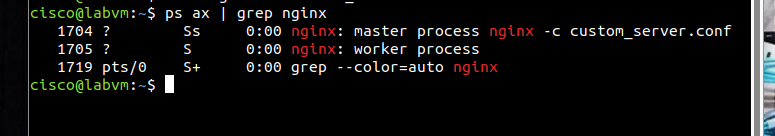
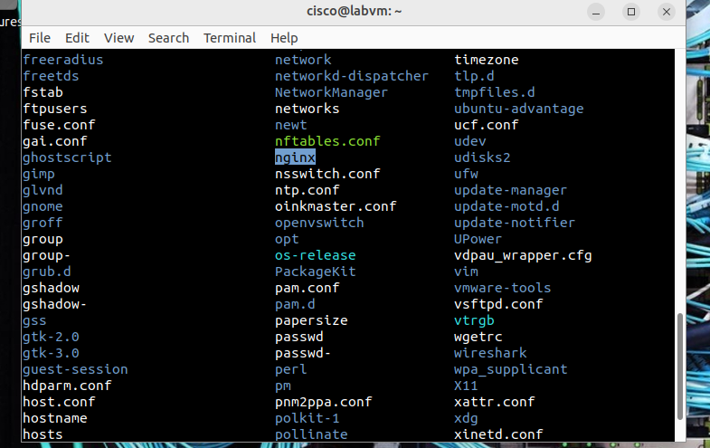
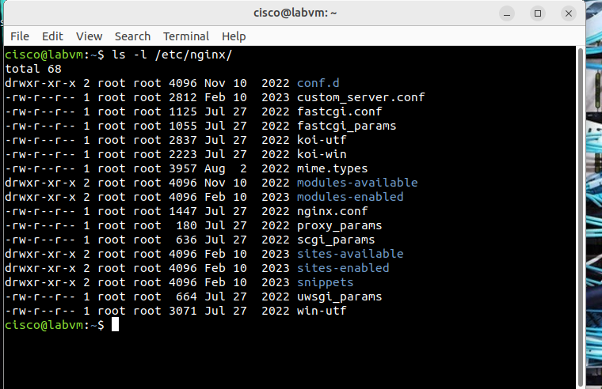
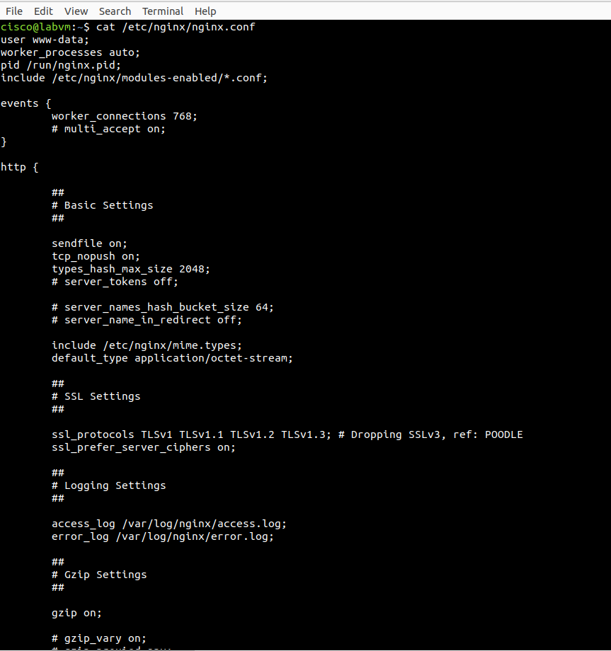

# Registros de eventos

## Parte 1: Descripcion general de los archivos de registro

### Paso 1 - Ejemplo de archivo de registro de un servidor web

a. 
```bash
[Wed Mar 22 11:23:12.207022 2017] [core:error] [pid 3548:tid 4682351596] [client
209.165.200.230] File does not exist: /var/www/apache/htdocs/favicon.ico
```
La entrada de registro muestra que en ese proceso se busco el archivo `/var/www/apache/htdocs/favicon.ico` y no se encontró.

b.
```bash
[analyst@secOps ~]$ cat /var/log/logstash-tutorial.log
83.149.9.216 - - [04/Jan/2015:05:13:42 +0000] "GET
/presentations/logstash-monitorama-2013/images/kibana-search.png HTTP/1.1" 200 203023
"http://semicomplete.com/presentations/logstash-monitorama-2013/" "Mozilla/5.0
(Macintosh; Intel Mac OS X 10_9_1) AppleWebKit/537.36 (KHTML, like Gecko)
Chrome/32.0.1700.77 Safari/537.36"
83.149.9.216 - - [04/Jan/2015:05:13:42 +0000] "GET
/presentations/logstash-monitorama-2013/images/kibana-dashboard3.png HTTP/1.1" 200
171717 "http://semicomplete.com/presentations/logstash-monitorama-2013/" "Mozilla/5.0
(Macintosh; Intel Mac OS X 10_9_1) AppleWebKit/537.36 (KHTML, like Gecko)
Chrome/32.0.1700.77 Safari/537.36"
83.149.9.216 - - [04/Jan/2015:05:13:44 +0000] "GET
/presentations/logstash-monitorama-2013/plugin/highlight/highlight.js HTTP/1.1" 200
26185 "http://semicomplete.com/presentations/logstash-monitorama-2013/" "Mozilla/5.0
(Macintosh; Intel Mac OS X 10_9_1) AppleWebKit/537.36 (KHTML, like Gecko)
Chrome/32.0.1700.77 Safari/537.36”
<some output omitted>
```

Este formato se diferencia porque cumplen distintos objetivos, el de este cat captura detalles sobre solicitudes HTTP, a diferencia del punto anterior que encuentra información especficica de errores y eventos del servidor.


### Paso 2 - Ejemplo de archivo de registro de un sistema operativo
```bash
[analyst@secOps ~]$ sudo more /var/log/messages
[sudo] contraseña para analyst:
Mar 20 08:34:38 secOps kernel: [6.149910] random: crng init done
Mar 20 08:34:40 secOps kernel: [8.280667] floppy0: no floppy controllers found
Mar 20 08:34:40 secOps kernel: [8.280724] work still pending
Mar 20 08:35:16 secOps kernel: [ 44.414695] hrtimer: interrupt took 5346452 ns
Mar 20 14:28:29 secOps kernel: [21239.566409] pcnet32 0000:00:03.0 enp0s3: link down
Mar 20 14:28:33 secOps kernel: [21243.404646] pcnet32 0000:00:03.0 enp0s3: link up,
100Mbps, full-duplex
Mar 20 14:28:35 secOps kernel: [21245.536961] pcnet32 0000:00:03.0 enp0s3: link down
Mar 20 14:28:43 secOps kernel: [21253.427459] pcnet32 0000:00:03.0 enp0s3: link up,
100Mbps, full-duplex
Mar 20 14:28:53 secOps kernel: [21263.449480] pcnet32 0000:00:03.0 enp0s3: link down
Mar 20 14:28:57 secOps kernel: [21267.500152] pcnet32 0000:00:03.0 enp0s3: link up,
100Mbps, full-duplex
Mar 20 14:29:01 secOps kernel: [21271.551499] pcnet32 0000:00:03.0 enp0s3: link down
Mar 20 14:29:05 secOps kernel: [21275.389707] pcnet32 0000:00:03.0 enp0s3: link up,
100Mbps, full-duplex
Mar 22 06:01:40 secOps kernel: [0.000000] Linux version 4.8.12-2-ARCH
(builduser@andyrtr) (gcc version 6.2.1 20160830 (GCC) ) #1 SMP PREEMPT Fri Dec 2
20:41:47 CET 2016
Mar 22 06:01:40 secOps kernel: [0.000000] x86/fpu: Supporting XSAVE feature 0x001:
'x87 floating point registers'
Mar 22 06:01:40 secOps kernel: [0.000000] x86/fpu: Supporting XSAVE feature 0x002:
'SSE registers'
Mar 22 06:01:40 secOps kernel: [0.000000] x86/fpu: Supporting XSAVE feature 0x004:
'AVX registers'
Mar 22 06:01:40 secOps kernel: [0.000000] x86/fpu: xstate_offset[2]: 576,
xstate_sizes[2]: 256
Mar 22 06:01:40 secOps kernel: [0.000000] x86/fpu: Enabled xstate features 0x7,
context size is 832 bytes, using 'standard' format.
Mar 22 06:01:40 secOps kernel: [0.000000] x86/fpu: Using 'eager' FPU context switches.
<some output omitted>
```

Podemos observar que el dia `Mar 20 14:29` aprox. la interfaz enp0s3 perdia la conexion y la recuperaba varias veces en intervalos cortos. 

## Parte 2: Ubicar archivos de registro en sistemas desconocidos

Inicio de nginx con `sudo nginx -c custom_server.conf`

<p align="center">
  <br>
  <em>Fig. Inicio de nginx en la VM</em><br>
</p>


Análisis en /etc `ls /etc/`
<p align="center">
  <br>
  <em>Fig. ls /etc. </em><br>
</p>

<p align="center">
  <br>
  <em>Fig. ls -l /etc/nginx/ </em><br>
</p>


<p align="center">
  <br>
  <em>Fig. cat /etc/nginx/nginx.conf </em><br>
</p>

