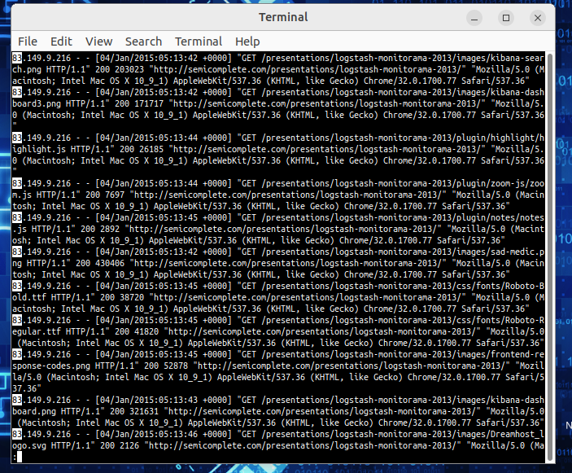
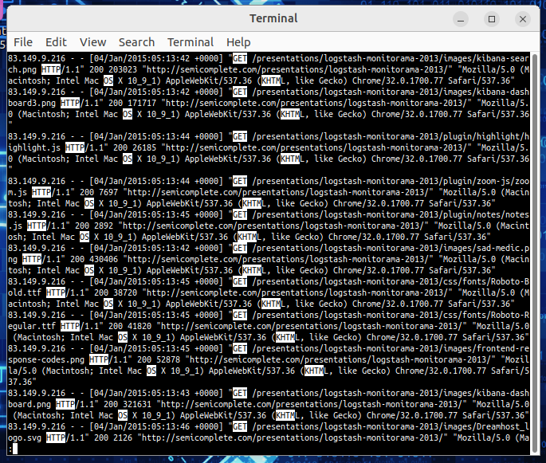
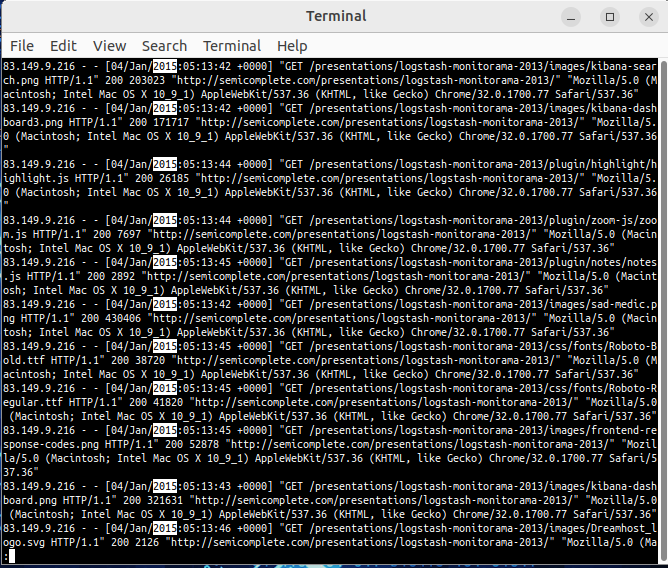
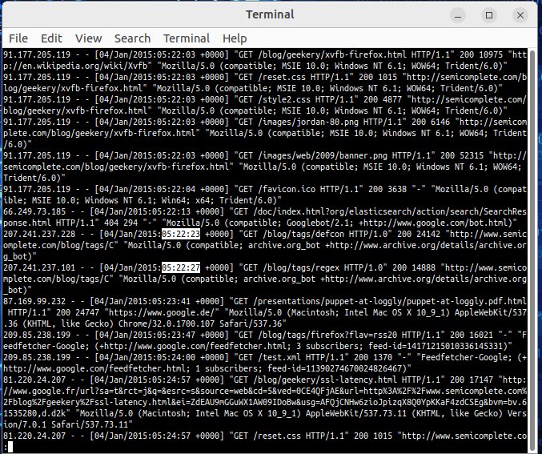
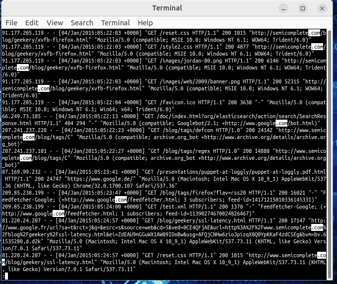
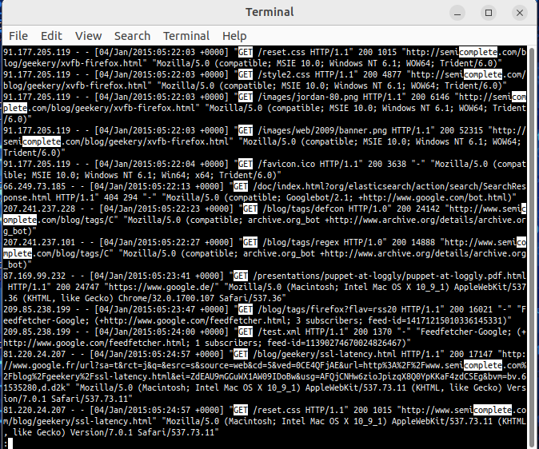
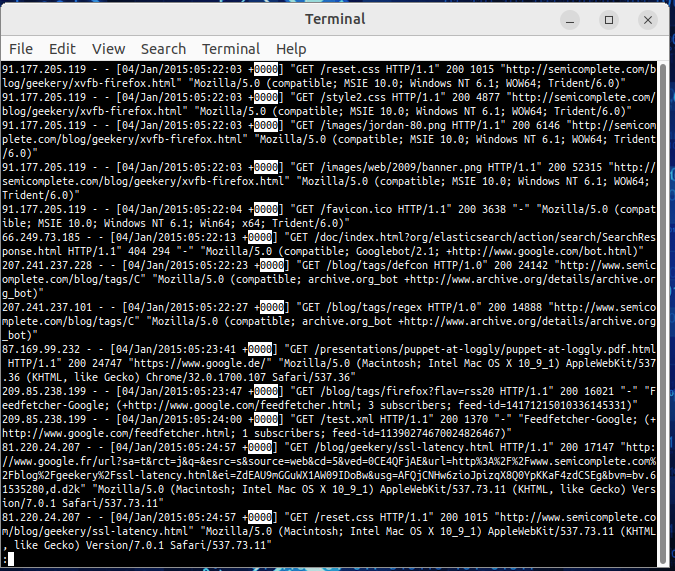

# Tutorial de expresiones regulares

## Paso 1: Completar el tutorial regexone.com.

a. Completar online el tutorial de expresiones regulares en regexone.com

b. Después de que hayan terminado el tutorial, describir la función de algunos de los metacaracteres que se utilizan en expresiones regulares.

| Metacaracteres  | Descripción   | Ejemplo |
|-------------|-------------|-------------|
| $  | Asegura el final de la linea con lo que está antes del caracter | `cripto$ - matchcripto`
| * | Refiere a repeticiones del caracter anterior  | `a* - "a","aaaa"`
| .  | Cualquier caracter excepto una nueva linea  | `a.j - "aXj"`
| [ ]  | Conjunto de caracteres permitidos | `[abc] - "a", "b", "c"`
| \.  | Se refiere al punto en lugar de un metacaracter  | `a\.b - "a.b"` 
| \d  | Coincide con cualquier digito entre 0 y 9  | `\d - "3","1","2"`
| \D  | Coincide con cualquier caracter que no sea un digito   | `\D - "a","F"`
| ^  | Asegura el inicio de lalinea con lo que esta despues del caracter | `^abc - "abccripto"`
| {m}  | m repeticiones exactas del caracter/string anterior | `w{2} - "ww"` 
| {n,m}   | n minima y m maximas repeticioens del caracter/string anterior | `w{2,3} - "ww","www"`
| abc\|123 | hace una or entre las dos expresiones | `abc\|123 - "abc","123"`

## Paso 2: Describir el patrón de expresión regular proporcionado.

| Patrón de expresión regular | Descripción | Ejemplo |
|-------------|-------------|-------------|
| ^83 | Cualquier linea que arranque con "83" | `83cripto`
| [A-Z]{2,4} | Define un conjunto de mayusculas como minimo 2 y maximo 4 | `AB` `XAMP`
| 2015 | Coincide exactamente con 2015 | `2015`
| 05:22:2[0-9] | Cadena en formato de horario donde el ultimo digito va entre 0 y 9 | `05:22:21`
| \.com | Busca el match con ".com" usando la barra para excluir el "." como metacaracter | `cualquiercosa.com`
| complete\|GET | Realiza la or entre las dos cadenas | `complete` o `GET`
| 0{4} | Coincide con exactamente cuatro 0's. | `0000`

## Paso 3: Verificar sus respuestas en la VM.

   
  <em>Fig. ^83 </em> 

   
  <em>Fig. [A-Z]{2,4} </em> 

   
  <em>Fig. 2015 </em> 

   
  <em>Fig. 05:22:2[0-9] </em> 

   
  <em>Fig. \.com </em> 

   
  <em>Fig. complete|GET </em> 

   
  <em>Fig. 0{4} </em> 

