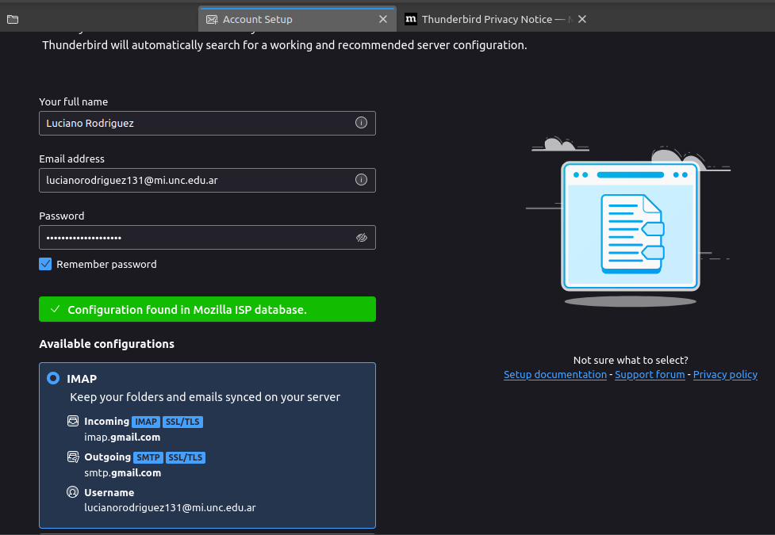

   

# Criptografía y seguridad 2024
# Firma Digital

## Configurar Thunderbird

Como primer paso se configura el cliente de thunderbird con nuestro correo.

   
  <em>Fig. Configuracion inicial de thunderbird</em>

## Generar par de claves

Para generar las claves desde el key Manager generamos con el correo asociado.

   
  <em>Fig. openPGP key manager</em>

## Exportar la clave para publicarla en servidores de referencia 

Utilizando servidores publicos de registro voluntario podremos intercambiar las claves públicas. Para esto se exporta el file y lo subimos a [Keys OpenPGP ORG](https://keys.openpgp.org/).

   
  <em>Fig. Keys OpenPGP ORG</em>

## Configurar la cuenta para utilizar la clave generada

Para esto desde la configuracion del cliente

   
  <em>Fig. End to end</em>

## Enviar un mensaje firmado y encriptado

Para enviar correos necesitamos compartir las claves (entonces nos las enviamos a nosotros mismos). Al enviarlo seleccionamos la opcion Encrypted de OpenPGP

   
  <em>Fig. Envio</em>

   
  <em>Fig. Mensaje encriptado</em>

Se observa que desde el cliente puedo observar el mensaje pero desde el navegador no se puede.

## Firma digital provista por terceros

Para esto usamos Actalis que nos provee certificados de correos electronicos gratis. Para esto realizamos la configuracion paso a paso hasta que nos dan la clave y el file del ceritificado.

   
  <em>Fig. Actalis</em>

Luego se configura el cliente agregando el certificado.

   
  <em>Fig. Agrega certificado</em>

   
  <em>Fig. Agrega certificado</em>

Luego ya podemos enviar un correo firmandolo 

